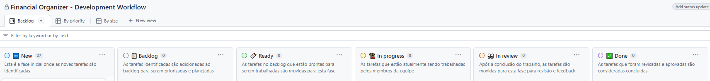

# Metodologia

Pré-requisitos: <a href="02-Especificação do Projeto.md"> Documentação de Especificação</a>

## Controle de Versão

A ferramenta de controle de versão adotada no projeto foi o [Git](https://git-scm.com/), sendo que o [Github](https://github.com) foi utilizado para hospedagem do [repositório](https://github.com/ICEI-PUC-Minas-PMV-ADS/pmv-ads-2024-1-e2-proj-int-t2-controle-patrimonial-pessoal).

O projeto segue a seguinte convenção para o nome de branches:

- `main`: versão estável já testada do software
- `develop`: versão de desenvolvimento e em testes do software

Quanto à gerência de issues, o projeto adota a seguinte convenção para
etiquetas:

- `Bug`: Para todos os problemas que causam um comportamento inesperado no software
- `Feature`: Para solicitações de novos recursos ou funcionalidades que ainda não existem no software
- `Enhancement`: Para solicitações de melhorias em recursos ou funcionalidades já existentes no software
- `Documentation`: Para problemas ou melhorias relacionados à documentação
- `Duplicate`: Para problemas que já foram relatados
- `Invalid`: Para problemas que não são realmente problemas
- `In Progress`: Para issues que estão em andamento e sendo trabalhadas
- `Ready for Review`: Para issues que estão prontas para revisão por outros membros da equipe
- `Blocked`: Para issues que estão bloqueadas por alguma dependência ou impedimento
- `Wontfix`: Para issues que não serão corrigidas no momento atual

O projeto segue a seguinte convenção para as categorias de commits:

- `feat`: Novas funcionalidades ou recursos adicionados ao software.
- `docs`: Alterações na documentação do projeto.
- `bugfix`: Correções de bugs ou problemas no software.
- `refactor`: Refatorações de código, sem alteração de comportamento visível para o usuário.
- `style`: Alterações na formatação do código, como espaçamento, indentação, etc.
- `test`: Adição ou modificação de testes unitários, testes de integração, ou testes de aceitação.
- `chore`: Tarefas de manutenção ou outras atividades que não afetam diretamente o funcionamento do software.

Para a gerência de merges o projeto segue a seguinte oderm:

- `Gerência de Merges`: As alterações no projeto são integradas por meio de pull requests revisadas por pares. Após a revisão e aprovação, as alterações são mescladas na branch principal do projeto, seguindo práticas recomendadas de merge para garantir a qualidade e integridade do código.

## Gerenciamento de Projeto

A equipe utiliza metodologias ágeis, tendo escolhido o Scrum como base para definição do processo de desenvolvimento.

### Divisão de Papéis

A equipe está organizada da seguinte maneira: 

Scrum Master: 
* Rodiney Branta 
---

Product Owner: 
* Kenia Aparecida Caires Cardoso​​​​​​​
---

Equipe de Desenvolvimento:
* Breno Vinícius Oliva Flores
* Gleiber Morinigo da Costa
* João Pedro Oggione Cerqueira Baptista Rodrigues
* Kenia Aparecida Caires Cardoso​​​​​​​
* Miguel Augusto da Silva Costa
* Rodiney Branta
---

Equipe de Design:
* Breno Vinícius Oliva Flores
* Kenia Aparecida Caires Cardoso
* Miguel Augusto da Silva Costa 
--- 

### Processo

Para organização e distribuição das tarefas do projeto, a equipe está utilizando o GitHub Projects estruturado com as seguintes listas:  

**New**: Esta é a fase inicial onde as novas tarefas são identificadas.

**Backlog**: As tarefas identificadas são adicionadas ao backlog para serem priorizadas e planejadas.

**Ready**: As tarefas no backlog que estão prontas para serem trabalhadas são movidas para esta fase.

**In Progress**: As tarefas que estão atualmente sendo trabalhadas pelos membros da equipe.

**In Review**: Após a conclusão do trabalho, as tarefas são movidas para esta fase para revisão e feedback.

**Done**: As tarefas que foram revisadas e aprovadas são consideradas concluídas.

O quadro kanban do grupo desenvolvido na ferramenta de gerenciamento de projetos está disponível através da URL do GitHub Project disponível na guia [Ferramentas] e é apresentado, no estado atual, na Figura `financial-organizer-development-workflow`.

Figura 'financial-organizer-development-workflow' - Tela do Kanban utilizado pelo grupo

### Ferramentas

Relação de Ambientes de Trabalho 

Os artefatos do projeto são desenvolvidos a partir de diversas plataformas e a relação dos ambientes com seu respectivo propósito é apresentada na tabela que se segue.  

|Ambiente | Plataforma |Link de Acesso |
|---|---|---|
|Repositório de código fonte |GitHub| [Controle Patrimonial](https://github.com/ICEI-PUC-Minas-PMV-ADS/pmv-ads-2024-1-e2-proj-int-t2-controle-patrimonial-pessoal)|
|Documentos do projeto |Discord|[PUCMG-EIXO2-EQUIPE1-2024](https://discord.gg/SSJEgS9W)|
|Projeto de Interface e  Wireframes|Figma e Lucidchart|[Repositório](https://www.figma.com/)|
|Gerenciamento do Projeto |GitHub Projects|[Financial Organizer - Development Workflow](https://github.com/orgs/ICEI-PUC-Minas-PMV-ADS/projects/1051)|
|Editor de código |Visual Studio Code|[Visual Studio Code](https://code.visualstudio.com/)|   |
