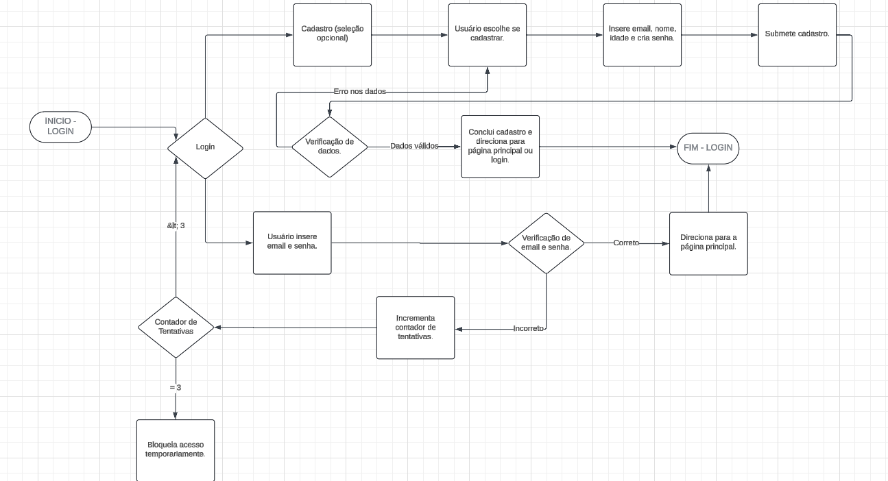
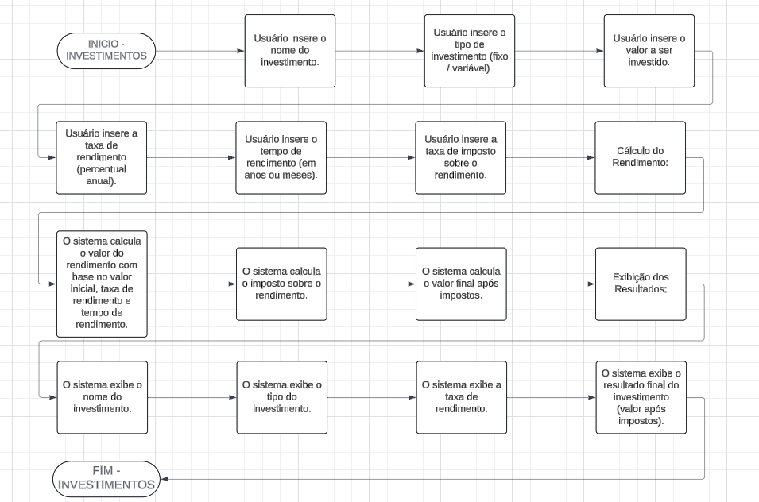
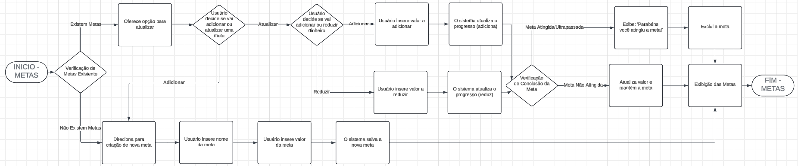
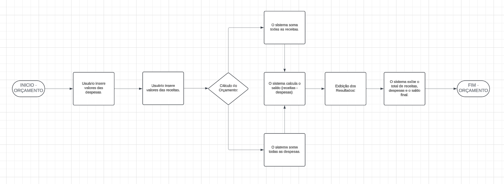
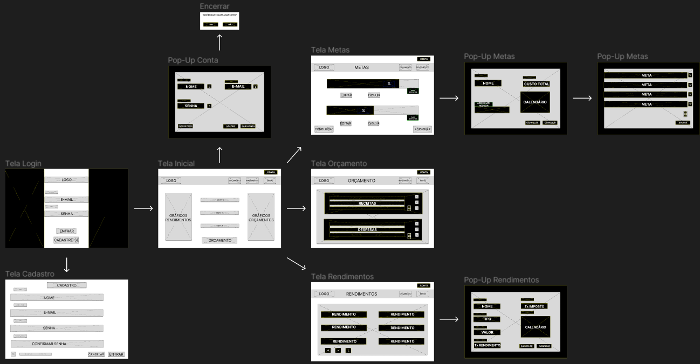

# Projeto de Interface

Pré-requisitos: <a href="02-Especificação do Projeto.md"> Documentação de Especificação</a>

Visão geral da interação do usuário pelas telas do sistema e protótipo interativo das telas com as funcionalidades que fazem parte do sistema (wireframes).

## Diagrama de Fluxo

O diagrama apresenta o estudo do fluxo de interação do usuário com o sistema interativo.

### Fluxograma - Login / Cadastro

- Este fluxograma começa com o usuário acessando a página de login, onde ele deve inserir seu email e senha. Se os dados estiverem incorretos, o sistema incrementa o contador de tentativas de login. Se o contador chegar a três tentativas, o acesso é temporariamente bloqueado. Se o usuário não tiver uma conta, ele pode optar por se cadastrar, fornecendo email, nome, idade e criando uma senha. Após a verificação dos dados, o cadastro é concluído, e o usuário pode logar ou acessar a página principal. O fluxograma termina com o usuário logado ou cadastrado com sucesso.

### Fluxograma - Investimento
docs\img\Metas.png

- O usuário acessa a ferramenta de orçamento e insere as receitas e despesas. O sistema calcula o total de receitas, o total de despesas e o saldo final (receitas menos despesas). Os resultados são então exibidos ao usuário, mostrando o total de receitas, despesas e o saldo. O processo termina quando o usuário visualiza essas informações.

### Fluxograma - Metas

- Iniciando com o acesso ao sistema de investimentos, o usuário insere informações como nome, tipo, valor investido, taxa de rendimento, tempo de rendimento e taxa de imposto. O sistema calcula o rendimento com base nesses dados e deduz os impostos aplicáveis, fornecendo o valor final do investimento após impostos. Os resultados mostram o nome, tipo, taxa de rendimento e o resultado final do investimento. O processo termina quando esses dados são exibidos ao usuário.

### Fluxograma - Orçamento

- O fluxograma inicia com a verificação de metas financeiras existentes. Se houver metas, o usuário pode optar por atualizá-las, adicionando ou reduzindo dinheiro conforme necessário. Se o valor da meta for atingido ou ultrapassado, o sistema exibe uma mensagem de parabéns e exclui a meta. Se não houver metas ou o usuário desejar adicionar novas, ele pode criar uma nova meta inserindo nome, valor total e progresso inicial. O sistema atualiza e exibe todas as metas, e o processo termina com o usuário visualizando as atualizações.

### Wireframe Interativo

[Link para visualização do wireframe interativo (Figma)](https://www.figma.com/file/JhUKP0fbabvJ44HwbLfGYC/Wireframe---CPP?type=design&node-id=0%3A1&mode=design&t=i5np2hBWmTzOmdDt-1)